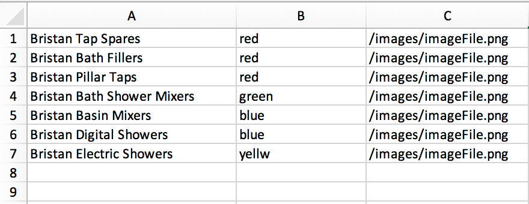

# Banner Magic 1.0.0
Banner Magic is a semi-automatic HTML banner creation application that can be used to speed up the process of creating a range of generic banners.

## Installation
Clone banner magic and then run `npm install` to download all the dependencies.

## Using the application
There is currently a three step process to using Banner Magic.

### Uploading the data
Inside the `Data` folder in the root of the application you will find an Excel sheet titled `data_model.xlsx`.

To update this data, open up the Excel and enter the data that you want. **Each row will be its own banner** and each column can represent what ever changing variable you need it to be. So here we are using column A for the title of the banner, column B as the colour and Column C as the image path.



#### THE ORDER OF THE COLUMNS IS IMPORTANT!

### Uploading a template
Once you have created one HTML banner and it has been tested and put through a QA process. Take the HTML code for the banner - which will most likely be from your local development environment - and navigate to the file `models.js` that can be found in the root of the application.

Once inside this file, you will see a function that will return the HTML template into the main `app.js`. To update the template, paste the HTML code between the back-ticks, like so...

```
const Model = () => {
  return `

  <PASTE YOUR TEMPLATE HTML CODE HERE>

  `
};

module.exports = {
  Model
};
```

To add variables into the code, firstly you will need to reference the name of the variable inside the parentheses of the Model function. So here will will add the title, colour and image link variables as seen in the previous Excel screenshot.

```
const Model = (title, colour, imgLink) => {
```

You can reference these in your HTML template using the template literal method - `${VARIABLE_NAME}`. Add these into the HTML using the same name as the variable that is being passed into the function. So adding the title variable would look like this...

```
<h1> ${title} </h1>
```
This will inject the contents of the title variable where `${title}` is placed, in this case between some `h1` tags.

Complete this step for each variable that you want to add into the HTML code.
