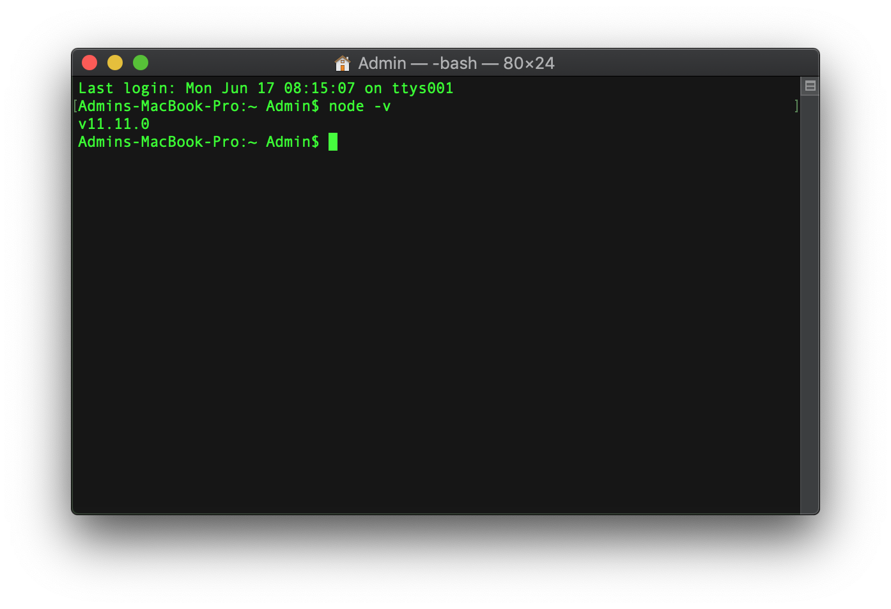
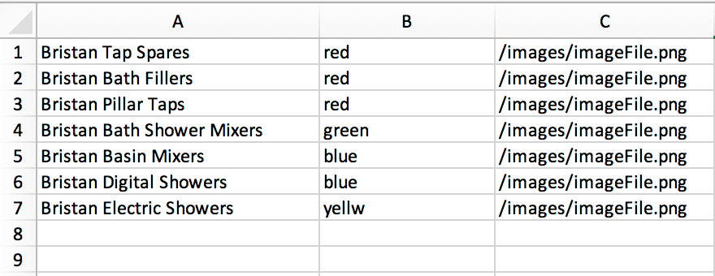
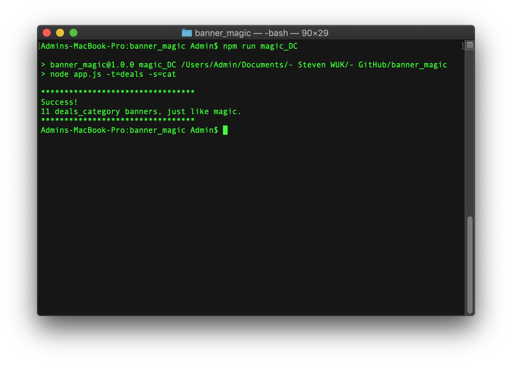
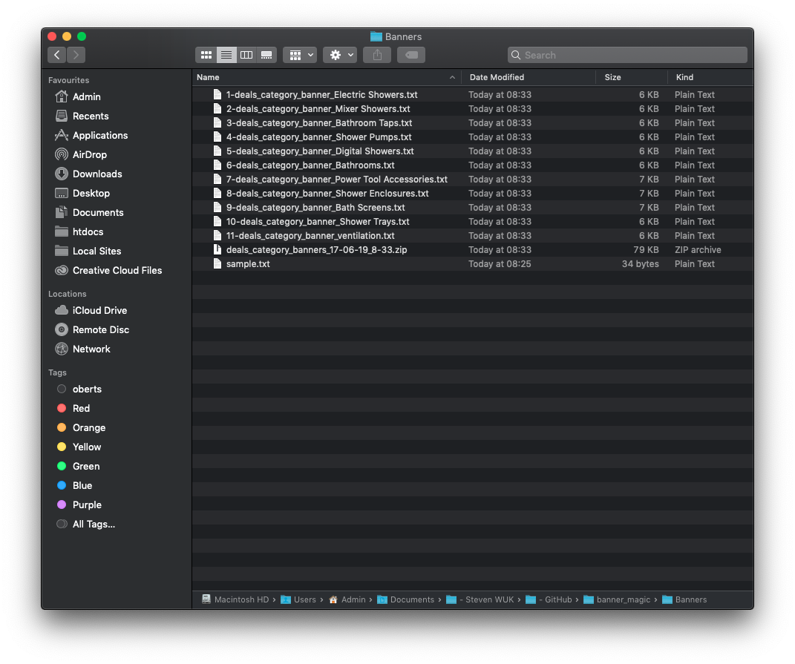
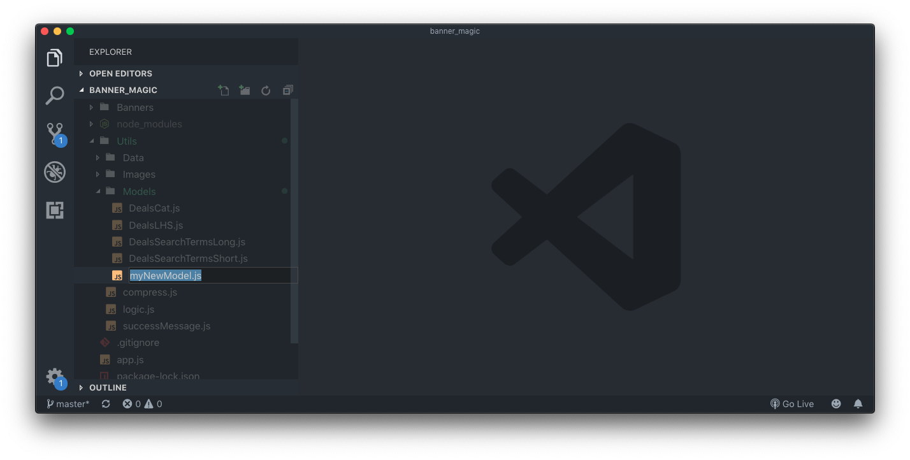
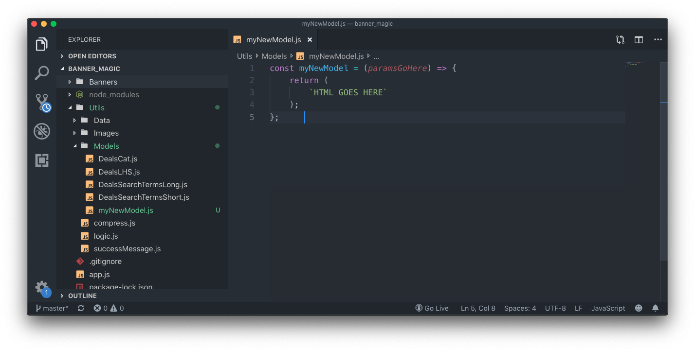
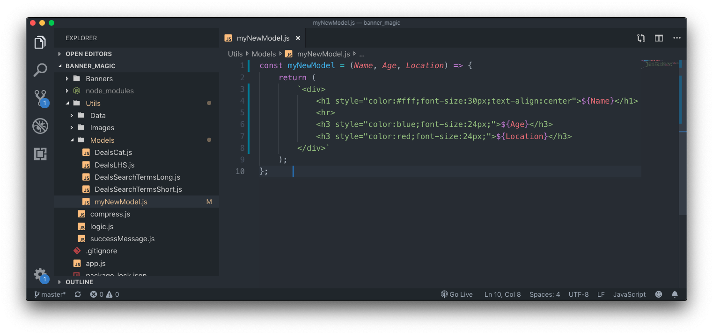
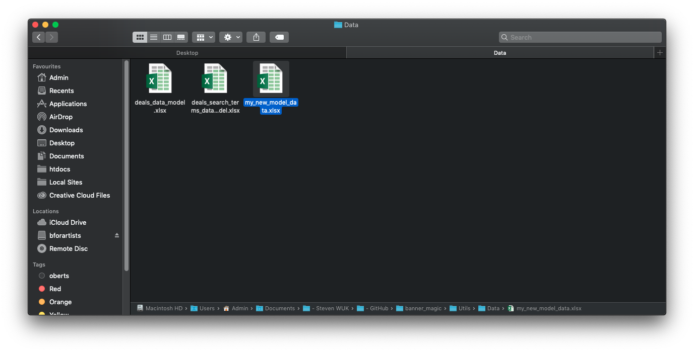
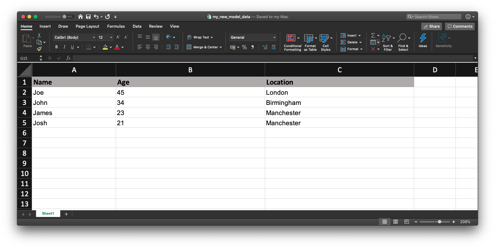

Banner Magic is a CLI application that can be used to speed up the process of creating repetitive HTML assets.

There are 2 steps to running Banner Magic -
 
**Add the data** > **Choose a template and run!**

Follow the contents sections below in order to setup the application to fit your needs.

### Download the application
[Click here!](https://github.com/WUK-SR/banner_magic/archive/master.zip)

### Contents
1. [Requirements](#Requirements)
2. [Installation](#Installation)
3. [Uploading the data](#Uploading_the_data)
4. [Choosing a template](#Choosing_a_template)
5. [Output](#Output)

## Requirements
Banner Magic requires Node.js version 10.9.0 or newer to operate.

Not sure if you have Node.js installed? Enter `node -v` in your terminal to check the version number.

If you have Node.js installed, you will get a version number returned to you, this number needs to be at least `v10.9.0` in order to run Banner Magic.

If you don't have Node.js installed, you can download it [here](https://nodejs.org/en/). 

### Installation

[Download](https://github.com/WUK-SR/banner_magic/archive/master.zip) the latest version banner magic and then run `npm install` to download all the dependencies. 

You are now ready to go!

## Uploading the data
Inside the `Data` folder - found inside `Utils` - you will find the Excel sheets that drive the content for the HTML assets.

To update this data, open up the desired Excel sheet and enter the data that you want, making sure to follow the supplied headings; each row in the data sheet will be treated as a seperate banner.

**Take a look below at the "Choosing a template" section to see what data sheet to use.**

## Choosing a template
Once the data has been loaded into the correct Excel sheet, you have the following templates to choose from.
1. Deals category banner - 745 x 150 - **Use data sheet deals_data_model.xlsx**
2. Deals search term banner (long) - 937 x 150 - **Use data sheet deals_data_model.xlsx**
3. Deals search term banner (short) - 750 x 150 - **Use data sheet deals_search_terms_data_model.xlsx**
4. Deals left hand side banner - 200 x 550 - **Use data sheet deals_search_terms_data_model.xlsx**

#### Deals category banner
To choose and run the app with a deals category banner template, use the line `npm run magic_DC`.

#### Deals LHS banner
To choose and run the app with a deals left hand side banner template, use the line `npm run magic_DLHS`.

#### Deals search term banner - short
To choose and run the app with a short deals search term banner template, use the line `npm run magic_DSTS`.

#### Deals search term banner - long
To choose and run the app with a long deals search term banner template, use the line `npm run magic_DSTL`.

Once you have picked a banner style, make sure you `cd` into the Banner Magic folder and then you can run the command of your choice.

## Output
The outputted code can be found in the `Banners` folder at the root level of the application. Once the application has been successfully run, this folder will be populated with each generated banner as a `.txt` file.

You will also get a `.zip` folder containing all of the generated banners.

## Adding new models
Adding new models to the application is easy to do, just follow these steps.

### Create a new model file

Inside the `Models` folder, create a new .js file with a title that describes what HTML asset will be generated from the model.

Inside this new .js file, create a `const` variable that has a value of an arrow function - leave room for parameters to be passed to the function as shown. The arrow function will `return` a block of html as a string.

Inside the parentheses of the functions `return`, paste the html template that you want to generate. 

***NOTE* - Use backticks to wrap the html rather than standard quotes, this will let you use template literals to dynamicly insert the parameters.**

Inside the parentheses of the function, add the parameters that you want dynamicly added to the html code. In this example we are using the parameters `Name`, `Age` and `Location`.

Using `template literals - ${VARIABLE}`, you can inject the parameters into the html code where desiered. 

***NOTE* - Due to the fact that most generated html assers are small in size, it is offten easier to use inline styling to keep things consistent and simple.**

### Create a new data set

Inside the `Data` folder, create a new .xlsx file that contains 

Inside that new data file, 