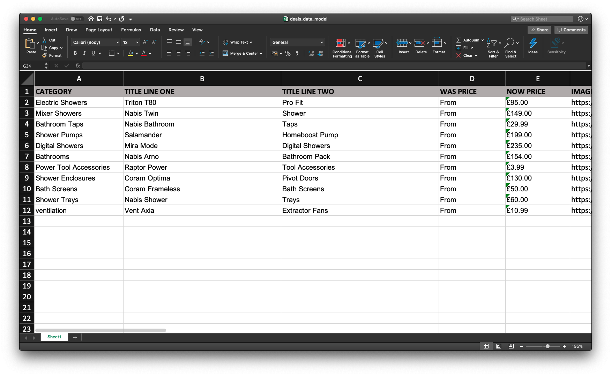

Banner Magic is a CLI application that can be used to speed up the process of creating repetitive HTML assets.

There are 2 steps to running Banner Magic -
 
**Add the data** > **Choose a template and run!**

Follow the contents sections below in order to setup the application to fit your needs.

### Download the application
[Click here!](https://github.com/WUK-SR/banner_magic/archive/master.zip)

### Contents
1. [Requirements](#Requirements)
2. [Installation](#Installation)
3. [Uploading the data](#Uploading_the_data)
4. [Choosing a template](#Choosing_a_template)
5. [Output](#Output)

## Requirements
Banner Magic requires Node.js version 10.9.0 or newer to operate.

Not sure if you have Node.js installed? Enter `node -v` in your terminal to check version number.

If you have Node.js installed, you will get a version number returned to you, this number needs to be at least `v10.9.0` in order to run Banner Magic.

If you don't have Node.js installed, you can download it [here](https://nodejs.org/en/).

## Installation
Download the latest version banner magic and then run `npm install` to download all the dependencies. You are now ready to go!

## Uploading the data
Inside the `Data` folder - found inside `Utils` in of the application - you will find four Excel sheets, `deals_data_model.xlsx`,`deals_search_terms_data_model.xlsx`, `online_offer_data_model.xlsx` and `hot_offers_data_model.xlsx`.

To update this data, open up the desired Excel and enter the data that you want, making sure to follow the supplied headings. **Each row will be its own banner** and you can generate both category/homepage banners from the same Excel sheet, just use the keyword `YES` in the `HP` column at the end of the sheet. Make sure to update the data in the correct Excel sheet, as they contain the correct branding/colours for that style of banner eg. deals or online offers.

## Choosing a template
Once the data has been loaded into the correct Excel sheet, you have the following templates to choose from.
1. Deals category banner - 745 x 150
2. Deals search term banner (long) - 937 x 150
3. Deals search term banner (short) - 750 x 150
4. Deals left hand side banner - 200 x 550

### Deals category banner
To choose and run the app with a deals category banner template, use the line `npm run magic_DC`.

### Deals LHS banner
To choose and run the app with a deals left hand side banner template, use the line `npm run magic_DLHS`.

### Deals search term banner - short
To choose and run the app with a short deals search term banner template, use the line `npm run magic_DSTS`.

### Deals search term banner - long
To choose and run the app with a long deals search term banner template, use the line `npm run magic_DSTL`.

## Output
The outputted code can be found in the `Banners` folder at the root level of the application. Once the application has been successfully run, this folder will be populated with each generated banner as a `.txt` file.

You will also get a `.zip` folder containing all of the generated banners.
